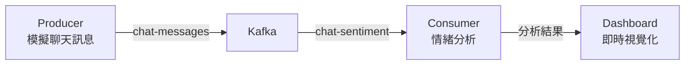

# Chat Stream Sentiment Analysis

用 Kafka 架設的即時客服訊息情緒分析系統。

## 系統架構



### 核心組件

- 🧾 **Producer**: 模擬客服聊天訊息生成器 (Python)
- 🧠 **Consumer**: 使用 TextBlob 進行情緒分析
- 📦 **Kafka Topics**:
  - `chat-messages`: 原始聊天訊息
  - `chat-sentiment`: 情緒分析結果
- 📊 **Dashboard**: 使用 Streamlit 即時顯示分析結果

### 資料流說明

1. Producer 每秒產生一則模擬的客服訊息
2. Consumer 接收訊息並進行情緒分析
3. 分析結果透過 Kafka 傳送到 Dashboard
4. Dashboard 即時更新顯示最新分析結果

## 系統需求

- Python 3.8+
- Docker 和 Docker Compose
- 相依套件:
  - kafka-python: Kafka 客戶端
  - textblob: 文字情緒分析
  - streamlit: 互動式儀表板
  - pymongo: MongoDB 客戶端（選用）

## 如何啟動

### 1. 啟動 Kafka 系統
```bash
docker compose up -d
```

### 2. 安裝 Python 套件
```bash
pip install -r requirements.txt
```

### 3. 執行模擬聊天產生器
```bash
python producer/simulate_chat.py
```

### 4. 執行情緒分析器
```bash
python consumer/sentiment_analyzer.py
```

### 5. 啟動儀表板
```bash
streamlit run dashboard/app.py
```

## 預期運行結果

1. **Producer 輸出**:
   - 會看到定期產生的模擬客服訊息
   - 包含使用者 ID、訊息內容和時間戳

2. **Consumer 輸出**:
   - 顯示每則訊息的情緒分析結果
   - 情緒分數範圍: -1 (非常負面) 到 1 (非常正面)

3. **Dashboard 顯示**:
   - 即時顯示訊息內容
   - 使用進度條視覺化情緒分數
   - 自動更新最新分析結果
